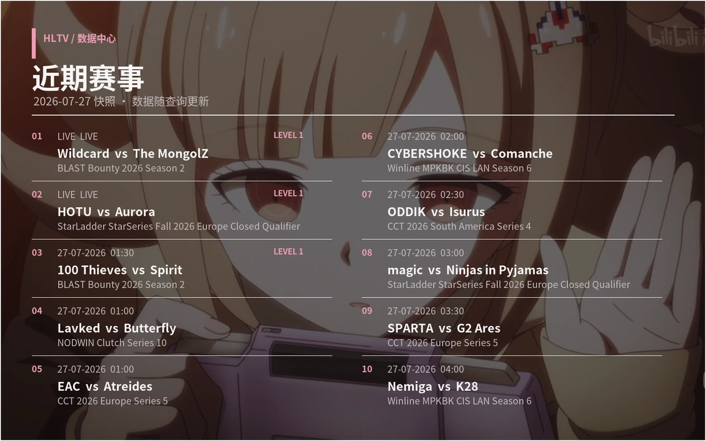
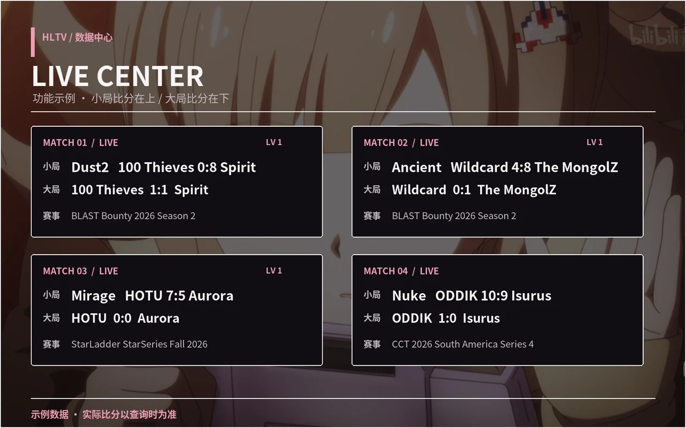
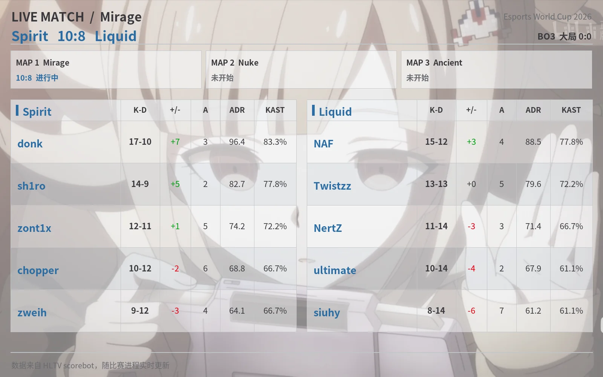
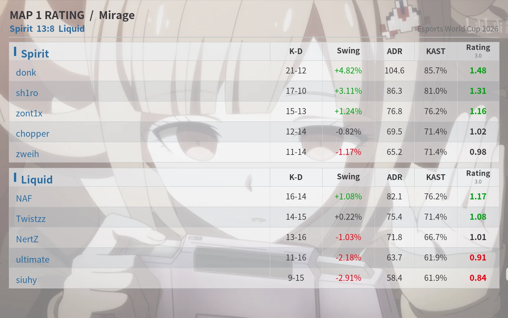
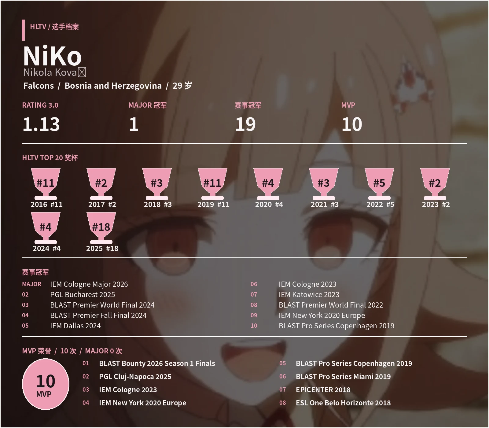

# astrbot_plugin_hltv

面向 [AstrBot](https://github.com/AstrBotDevs/AstrBot) 的 HLTV 查询与比赛提醒插件。
提供 CS2 赛程、实时比分、赛果、排名、战队与选手资料、新闻翻译、年度 TOP20，
并支持直播订阅、逐图 Rating 和 AstrBot 大模型工具调用。

## 功能概览

| 模块 | 内容 |
| --- | --- |
| 比赛中心 | 今日赛程、近期比赛、实时比分、历史赛果、近期赛事 |
| 直播追踪 | 当前地图比分、系列赛比分、BO3/BO5 选图、双方十人实时战绩 |
| 比赛提醒 | 首图开赛、新地图开始、逐图 Rating、整场完赛 Rating |
| 战队资料 | Valve/HLTV 排名、阵容、教练、Major 冠军、奖杯、近期战绩 |
| 选手资料 | 当前 Rating、TOP20 排名、Major、冠军与 MVP 荣誉 |
| 排名与榜单 | Valve VRS 全球/地区排名、HLTV 世界排名、年度 TOP20 |
| 新闻 | 今日新闻、中英双语标题、中文摘要与原文链接 |
| AstrBot 集成 | `query_hltv` 大模型工具、群聊免 @ 指令、每日赛程推送 |

列表、排名和资料查询默认生成图片卡片；图片渲染失败时自动回退为文字，查询本身不会中断。

## 效果预览

| 近期赛事 | 实时比分 |
| :---: | :---: |
|  |  |

| 赛中十人实时战绩 | 逐图 Rating |
| :---: | :---: |
|  |  |

### 选手详情



## 安装

### AstrBot WebUI

在插件市场搜索 `HLTV` 安装；也可以下载 Release 压缩包，在插件管理页直接上传。
安装或更新完成后重载插件。

### 手动安装

```bash
cd data/plugins
git clone https://github.com/tianyingtl/astrbot_plugin_hltv.git
cd astrbot_plugin_hltv
pip install -r requirements.txt
```

随后在 AstrBot WebUI 中重载插件。

## 常用操作

| 需求 | 指令 |
| --- | --- |
| 查看当前直播 | `/live` 或 `/hltv live` |
| 订阅直播列表中的比赛 | `/hltv live 1 2 3` |
| 查看并订阅指定战队 | `/hltv live <战队>` |
| 调整当前赛事防剧透延迟 | `/hltv 防剧透 <数字>`（与 `antijutou` 为同一命令） |
| 查看今日赛程 | `/hltv today` |
| 查看近期赛果 | `/hltv results [天数]` |
| 查看战队资料 | `/hltv team <名称>` |
| 查看选手资料 | `/hltv player <昵称>` |
| 查看年度 TOP20 | `/hltv top20 [年份]` |
| 查看今日新闻 | `/hltv news` |

默认允许在群聊中直接发送 `/hltv ...`，无需 @ 机器人。所有子指令均提供中文别名。

## 直播与订阅

### 查看直播

`/live` 和 `/hltv live` 只显示当前正在进行的比赛，不会自动订阅，也不会混入今日待开赛场次。
直播卡片中小局比分显示在上方，系列赛大比分与 BO 几显示在下方。

### 按序号订阅

发送直播列表后，可以使用 `/hltv live 1 2 3` 按卡片序号订阅一场或多场比赛。
订阅选择只在当前用户和当前会话中生效，避免不同群聊或用户之间串号。

### 按战队订阅

`/hltv live <战队>` 会优先查找该队正在进行的比赛：

- 比赛进行中：返回单场详情图，展示当前地图、比分、十人实时战绩和本场选图，同时订阅后续提醒。
- 今日尚未开赛：订阅该队今天的待开赛比赛，首张地图正式开始后 @ 订阅用户。
- 当前和今日均无比赛：直接说明没有可订阅场次。

战队查询统一支持常见英文缩写和中文称呼，可用于 `live`、`team` 等相关入口。

### 提醒内容

- 新地图正式开始时推送地图、当前比分和系列赛比分。
- 每张地图结束后推送该图的 HLTV Rating 表格。
- 整场结束后推送最终赛果和全场 Rating。
- Rating 数据出现后默认等待 1 分钟再推送，降低比分领先直播流造成的剧透。
- BO1 只发送一次 Rating 结果，避免逐图与完赛数据重复。
- 订阅状态持久化保存，AstrBot 重启后仍可继续追踪。

### 防剧透延迟

`防剧透` 和 `antijutou` 是同一个命令，只需要填写数字，默认单位固定为分钟，不需要填写 `min` 或“分钟”。参数支持任意正数、负数和小数：正数增加当前延迟，负数减少当前延迟，小数按分钟计算。

例如，`/hltv 防剧透 20` 表示在当前 Rating 延迟上增加 20 分钟，默认状态下会从 1 分钟变为 21 分钟；`/hltv antijutou -2` 表示将当前 Rating 延迟减少 2 分钟；`0.5` 表示增加半分钟。Rating 延迟最低为 1 分钟，不会减成负数。

命令不需要填写赛事名，会直接查询 HLTV 当前直播，自动选择至少一星且星级最高的赛事；同一赛事的多场直播会合并识别。若多个不同赛事并列最高星级，插件会列出赛事并停止修改，避免选错。

设置对所有用户全局生效，但只作用于自动识别出的赛事全部比赛，不会影响其他赛事。命令执行后只显示当前 Rating 推送延迟，例如输入 `1` 后显示“当前 Rating 推送延迟：2 分钟”。

使用 `/hltv live 取消` 可以取消当前账号在当前会话中的全部直播提醒。

## 完整指令

### 比赛

| 指令 | 说明 |
| --- | --- |
| `/hltv today` | 今日赛程 |
| `/hltv matches [天数]` | 近期比赛，默认天数由配置决定，最多 7 天 |
| `/live`、`/hltv live` | 当前直播列表，不自动订阅 |
| `/hltv live 1 2 3` | 按直播卡片序号批量订阅 |
| `/hltv live <战队>` | 查看该队赛中详情，或订阅今日待开赛比赛 |
| `/hltv live 取消` | 取消当前会话中的直播提醒 |
| `/hltv 防剧透 <数字>`、`/hltv antijutou <数字>` | 同一命令；自动识别当前直播大赛，单位默认分钟 |
| `/hltv results [天数]` | 近期赛果，最多 7 天 |
| `/hltv events` | 近期赛事列表 |

### 排名与资料

| 指令 | 说明 |
| --- | --- |
| `/hltv ranking` | Valve VRS 全球排名 |
| `/hltv ranking asia` | Valve VRS 亚洲排名 |
| `/hltv ranking europe` | Valve VRS 欧洲排名 |
| `/hltv ranking americas` | Valve VRS 美洲排名 |
| `/hltv ranking hltv` | HLTV 世界排名 |
| `/hltv team <名称>` | 战队排名、阵容、Major、奖杯和近期战绩 |
| `/hltv player <昵称>` | 选手资料、Rating、TOP20、冠军与 MVP |
| `/hltv top20 [年份]` | 年度 TOP20 总榜；不填年份时查询上一年 |
| `/hltv top20 <年份> <名次>` | 指定名次的新闻内容和个人 TOP 图片 |

### 新闻与推送

| 指令 | 说明 |
| --- | --- |
| `/hltv news` | 今日新闻列表，中英双语标题 |
| `/hltv news <序号>` | 新闻中文摘要、英文原标题和原文链接 |
| `/hltv sub` | 订阅当前会话的每日赛程推送 |
| `/hltv unsub` | 取消当前会话的每日赛程推送 |
| `/hltv help` | 显示插件内置帮助 |

## AI 资料查询

插件会向 AstrBot 注册 `query_hltv` 大模型工具。使用支持工具调用的模型时，可以直接询问
CS 职业比赛、赛程、赛果、排名、赛事、战队、选手、新闻或年度 TOP20，无需先输入指令。

工具支持以下查询类型：

`live`、`schedule`、`results`、`ranking`、`events`、`team`、`player`、`news`、`top20`

`live`、`schedule` 和 `results` 可按战队、赛事全名、赛事简称或中文称呼筛选。
该工具只向模型返回文字资料，不发送图片，也不会创建直播订阅；图片查询和提醒仍由 `/hltv` 指令负责。

## TOP20

- `/hltv top20` 默认查询上一年度完整榜单。
- `/hltv top20 2023` 查询指定年份榜单。
- `/hltv top20 2025 18` 查询指定年份和名次的个人专题。
- 新年份优先读取 HLTV 官方榜单与图片。
- 历史年份可使用已收录的 5E 总榜海报；图片无法获取时由插件按同一榜单数据本地渲染。

## 配置

在 AstrBot WebUI 的插件配置页中修改：

| 配置项 | 默认值 | 说明 |
| --- | --- | --- |
| `min_stars` | `1` | `today`、`matches` 的最低比赛星级，范围 0-5 |
| `event_keywords` | 空 | 赛事关键词白名单，仅作用于 `today`、`matches` |
| `translate_news` | 开启 | 翻译新闻标题和详情，同时保留英文原标题 |
| `live_poll_interval` | `45` | 直播订阅检查间隔，限制为 20-300 秒 |
| `enable_push` | 关闭 | 每日赛程推送总开关，修改后需重载插件 |
| `push_time` | `09:00` | 每日推送时间，使用插件时区 |
| `push_sessions` | 空 | 推送目标会话，通常由 `/hltv sub` 自动维护 |
| `default_days` | `1` | `matches`、`results` 的默认查询天数 |
| `max_items` | `10` | 列表类图片和文字最多显示的条数 |
| `free_wake` | 开启 | 允许无需 @ 直接调用 `/hltv` |
| `send_waiting_tip` | 关闭 | 无缓存时先发送查询提示 |
| `timezone` | `Asia/Shanghai` | 比赛时间、日期和定时推送所用时区 |
| `proxy_list` | 空 | HLTV 请求代理列表 |
| `timeout` | `15` | 单次请求超时时间，单位为秒 |
| `max_retries` | `3` | 请求失败后的最大重试次数 |
| `cache_ttl` | `300` | 查询缓存时间；设为 0 可关闭缓存 |

## 数据与回退

- 比赛、战队、选手、排名、赛事和新闻数据来自 HLTV。
- 当前地图实时比分与十人战绩来自 HLTV scorebot，不使用估算数据替代。
- 逐图和完赛 Rating 以 HLTV 页面实际更新时间为准，数据尚未同步时插件会继续等待。
- HLTV 存在访问频率限制；直连不稳定时可配置 `proxy_list`，并适当增加缓存时间。
- 新闻翻译服务不可用时保留英文原文，不影响新闻列表和链接。
- 图片渲染失败时自动发送对应文字结果。

本项目与 HLTV 无官方关联。赛事数据、新闻和相关素材版权归其原权利人所有。
